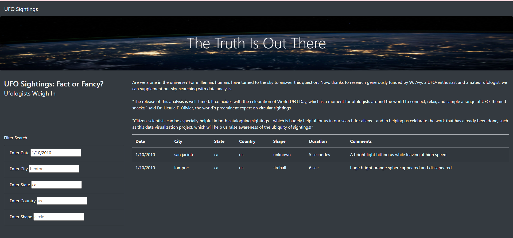

# UFOs
Creating a webpage with JavaScript and HTML containing UFOs information
## Overview of Project
In this project, Dana and her team has focused providing detailed analysis of all UFO sightings by creating dynamic webpage using table and filter features of html with java script language. Here basic html, bootstrap and CSS has been used to style the webpage visualization. 
## Results
Below screenshot of UFO site shows the description of webpage. How this webpage will help all scientist to gather all UFO sighting data at one place. With help of Visual studio code and HTML, Dana and her team was able to present in depth UFO sightings data and description section is giving glimpsom about it. 

Below image shows the filter function added to a webpage which is convenient option for scientist to filter the data as per their preference and take out limited information by saving time in searching data on various sites. 

This table represents how filter will work when you will select city or date or any other option you want to collect data for and it will generate the information within a second. 

### UFO sighting webpage

## Summary
- Drawback of the webpage
First and foremost drawback is user can't select the items from filter section that he/she wants to go for. One should know what they want to find or search on UFO webpage while using filter option. 
- Recommendations
1. Dana and her team can add options under filter section for the user to choose from. This will make functionality of filter and table of UFO sighting more advanced and vast variety of audience can visit UFO webpage for collecting information without any prior knowledge about ufology. 
2. Webpage can get edited more nicely and precisely. Space between table and description can be reduced and precise details about what table is about and how data can be useful for user need to be explained on webpage. 
